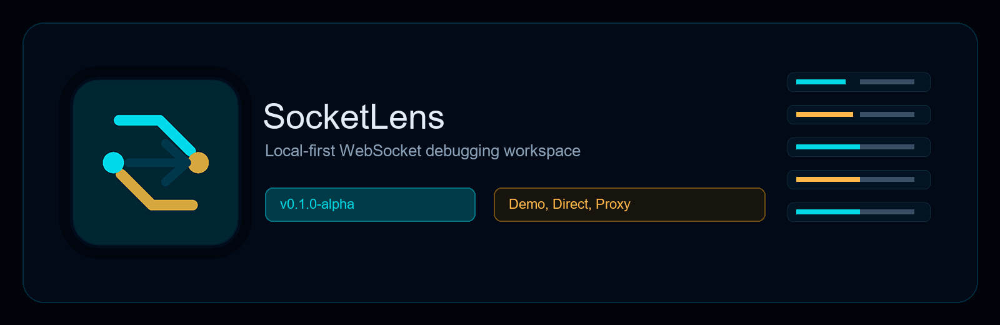
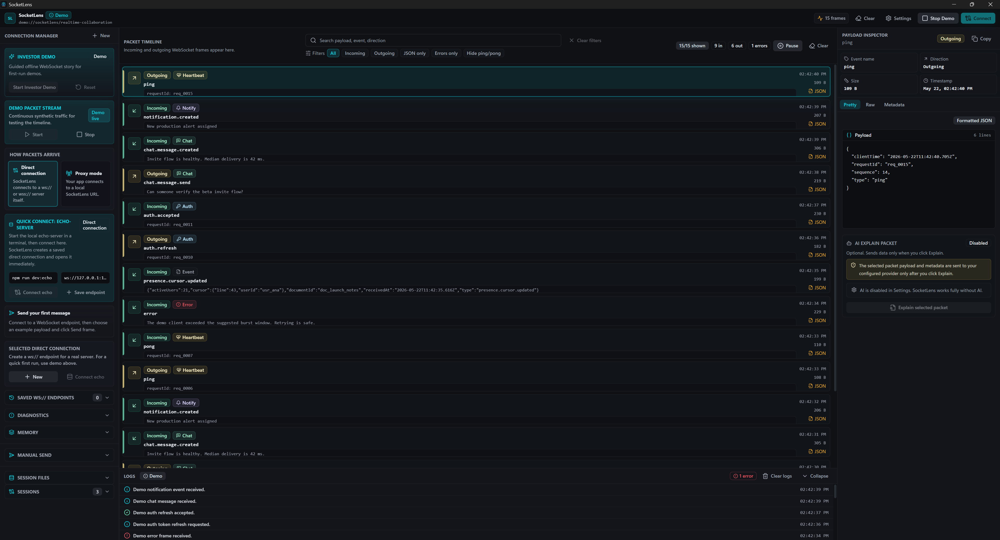
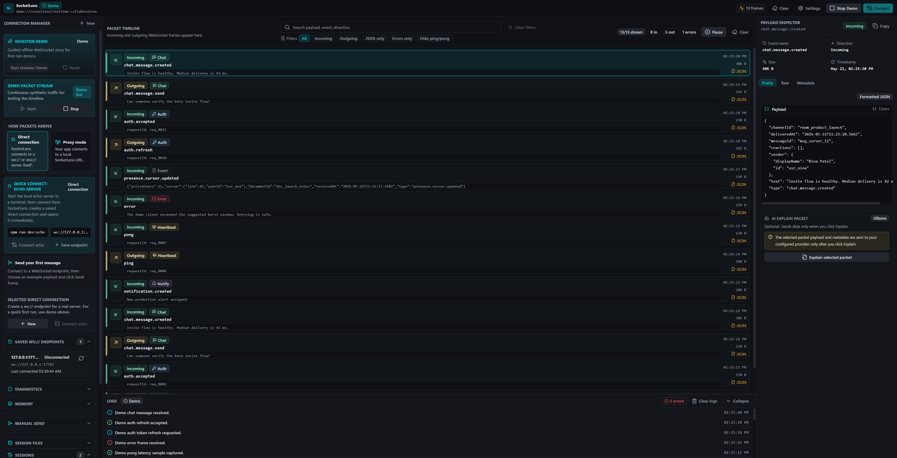
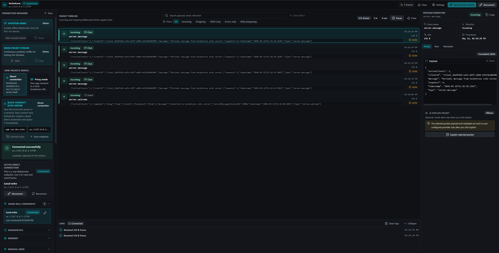
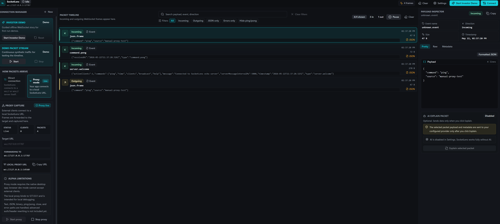
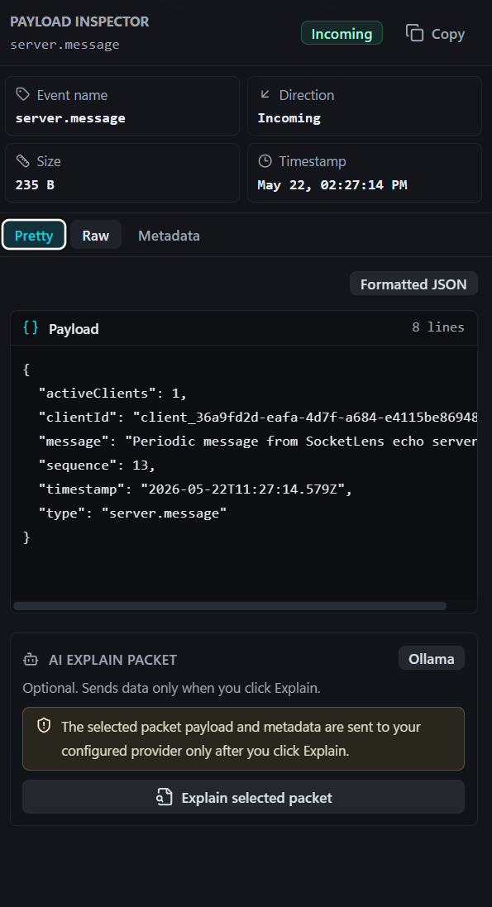
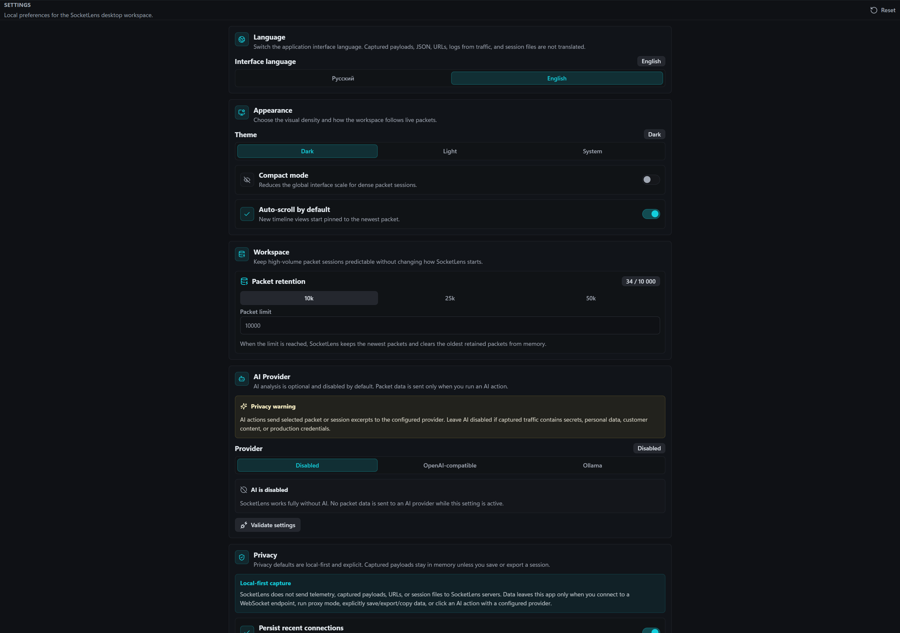
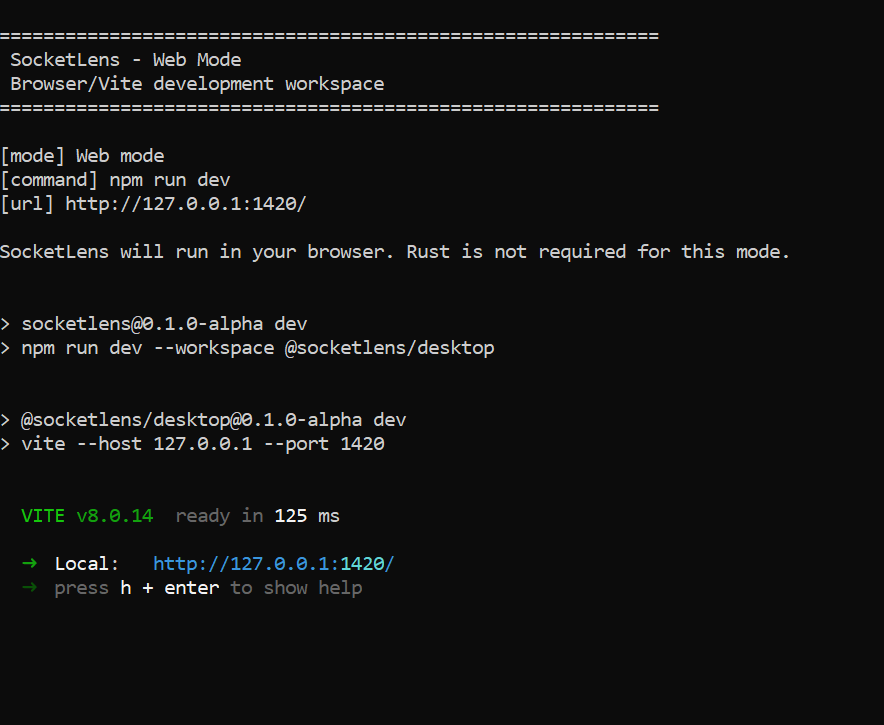
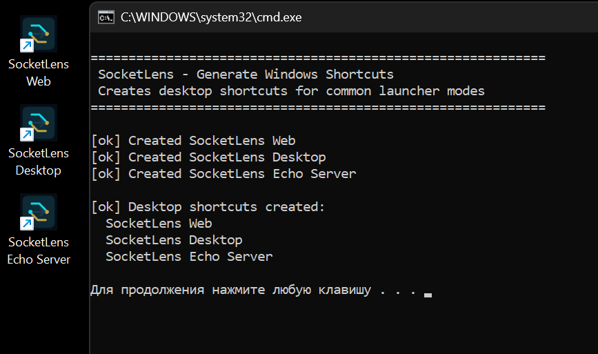

# SocketLens



[](https://github.com/DenisGeide/socketlens/actions/workflows/ci.yml)
[](https://github.com/DenisGeide/socketlens/actions/workflows/release.yml)
[](LICENSE)

**Project status: v0.1.0-alpha**

SocketLens is a local-first WebSocket debugger for developers building realtime apps. It helps you connect to WebSocket endpoints, inspect frames, replay outbound messages, save sessions, and demo realtime traffic without a production backend.

This is an alpha release. It is usable for local development and demos, but it is not a stable commercial product yet.

## What Problem SocketLens Solves

Realtime applications are hard to debug with generic browser tools. Auth handshakes, chat events, notifications, heartbeats, retries, and errors often appear as scattered logs instead of a readable event flow.

SocketLens gives that traffic a focused workspace:

- a packet timeline for inbound and outbound frames,
- a payload inspector for Pretty, Raw, and Metadata views,
- manual send and replay tools,
- local session files,
- an offline demo mode,
- a native proxy mode for inspecting traffic from another client.

## Features

What works in `v0.1.0-alpha`:

- **Demo Mode**: synthetic offline traffic clearly marked as simulated.
- **Direct Mode**: connect SocketLens directly to `ws://` or `wss://` endpoints.
- **Proxy Mode**: native Tauri/Rust proxy MVP for external clients.
- **Packet Timeline**: virtualized list with direction, event name, timestamp, payload preview, size, badges, filters, and search.
- **Payload Inspector**: Pretty JSON, Raw text, Metadata, copy support, and safe handling of invalid JSON.
- **Socket.IO Decoding**: detects Engine.IO/Socket.IO frames, event names, namespaces, acknowledgements, and protocol badges while keeping Raw payloads available.
- **GraphQL WS Decoding**: detects common GraphQL WebSocket subscription envelopes, operation names, lifecycle labels, and protocol badges.
- **Manual Send and Replay**: send JSON or raw text, reuse previous outgoing packets, and replay while connected.
- **Environments**: Local, Staging, and Production variables with `{{base_url}}` / `{{auth_token}}` interpolation.
- **Session Files**: save/load SocketLens session JSON, export packets, and create experimental inferred AsyncAPI-like YAML drafts.
- **Echo Server**: local TypeScript WebSocket server on `ws://127.0.0.1:17787`.
- **Socket.IO Demo**: local TypeScript Socket.IO server for testing decoded events on `ws://127.0.0.1:17810/socket.io/?EIO=4&transport=websocket`.
- **Settings**: theme, compact mode, auto-scroll, packet retention, language, AI provider, and privacy options.
- **Localization**: Russian by default, English available in Settings.
- **Optional AI**: disabled by default, supports OpenAI-compatible endpoints and Ollama when configured.

Current alpha limitations:

- Desktop builds are unsigned.
- Proxy Mode requires native desktop mode and is still an MVP.
- Browser mode cannot start the native Rust proxy.
- Rust/Cargo and Tauri prerequisites are required for desktop mode.
- No telemetry, accounts, hosted sync, cloud workspace, or paid service exists in this alpha.
- Public screenshots must be captured from real implemented behavior.

## Screenshots

These screenshots are a guided visual tour of real implemented SocketLens behavior.

### Main Workspace

The core layout is a desktop-style debugging workspace: connection tools on the left, packet timeline in the center, payload inspector on the right, and logs at the bottom.



### Guided Product Tour

<table>
  <tr>
    <td width="50%">
      <strong>Investor Demo Mode</strong><br>
      Offline simulated traffic for first-run demos. Useful when someone wants to understand SocketLens without starting a server.<br><br>
      
    </td>
    <td width="50%">
      <strong>Direct WebSocket Mode</strong><br>
      SocketLens connects directly to a <code>ws://</code> or <code>wss://</code> endpoint. This screenshot shows the local echo server flow.<br><br>
      
    </td>
  </tr>
  <tr>
    <td width="50%">
      <strong>Proxy Mode</strong><br>
      Native desktop proxy mode creates a local proxy URL. External clients connect to SocketLens, and forwarded frames appear in the timeline.<br><br>
      
    </td>
    <td width="50%">
      <strong>Payload Inspector</strong><br>
      Selecting a packet opens formatted JSON, raw payload, metadata, copy, and optional AI explain controls. AI is disabled by default.<br><br>
      
    </td>
  </tr>
  <tr>
    <td width="50%">
      <strong>Settings</strong><br>
      Settings are local: language, environments, visual density, packet retention, AI provider, and privacy controls.<br><br>
      
    </td>
    <td width="50%">
      <strong>One-click Launchers</strong><br>
      Launchers provide a friendlier way to start web mode, desktop mode, and the local echo server. They run <code>npm install</code> automatically on first launch if dependencies are missing.<br><br>
      <br><br>
      
    </td>
  </tr>
</table>

Screenshot capture guidance lives in [docs/screenshots.md](docs/screenshots.md). Interface-area explanations live in [docs/ui-guide.md](docs/ui-guide.md).

<details>
<summary><strong>Asset references</strong></summary>

Branding assets live in [docs/assets/branding](docs/assets/branding):

- [icon.png](docs/assets/branding/icon.png)
- [banner.png](docs/assets/branding/banner.png)

Release assets live in [docs/assets/release](docs/assets/release):

- [release-notes-template.md](docs/assets/release/release-notes-template.md)

When replacing assets, keep the same filenames unless every README, release, and documentation reference is updated in the same change.

</details>

## Quick Start

SocketLens uses **npm workspaces** and the committed lockfile is `package-lock.json`.

Prerequisites for browser mode:

- Node.js `20.19.0+` on the 20.x line, or `22.12.0+`
- npm `10+`

Prerequisites for desktop mode:

- Node.js and npm
- Rust/Cargo
- Tauri OS prerequisites for your platform

Clone and install:

```bash
git clone https://github.com/DenisGeide/socketlens.git
cd socketlens
npm install
```

Start web mode:

```bash
npm run dev
```

Expected result: SocketLens opens at `http://127.0.0.1:1420/`.

What to click first:

1. Click **Start Investor Demo** or **Start demo**.
2. Watch packets appear in the timeline.
3. Select a packet.
4. Open Pretty, Raw, or Metadata in the inspector.

Then test a real local WebSocket round trip:

```bash
npm run dev:echo
```

Connect Direct Mode to:

```text
ws://127.0.0.1:17787
```

Send:

```json
{ "command": "ping" }
```

Expected result: SocketLens captures the outbound ping, the echo frame, and a `command.pong` response.

## One-click Launch

The repository includes branded convenience launchers under [launchers](launchers). They call the same npm scripts documented below; they are just friendlier entry points for people who prefer double-clickable files.

The start launchers automatically run `npm install` on first launch if `node_modules` is missing. Node.js/npm must still be installed first. Desktop mode also requires Rust/Cargo and Tauri OS prerequisites.

Windows:

```bat
launchers\install-windows.bat
launchers\start-web.bat
launchers\start-echo-server.bat
launchers\start-desktop.bat
launchers\generate-shortcuts.bat
```

macOS/Linux:

```bash
sh ./launchers/install-unix.sh
sh ./launchers/start-web.sh
sh ./launchers/start-echo-server.sh
sh ./launchers/start-desktop.sh
```

What they do:

- `launchers\install-windows.bat` / `launchers/install-unix.sh` run `npm install`.
- `launchers\start-web.bat` / `launchers/start-web.sh` run `npm run dev`.
- `launchers\start-echo-server.bat` / `launchers/start-echo-server.sh` run `npm run dev:echo`.
- `launchers\start-desktop.bat` / `launchers/start-desktop.sh` run `npm run dev:desktop`.
- `launchers\generate-shortcuts.bat` creates optional Windows desktop shortcuts for Web, Desktop, and Echo Server launchers using the SocketLens icon.

The install scripts are still useful when you want to set everything up explicitly before launching.

Use **SocketLens Web** first if you only want to try the app quickly. Use **SocketLens Desktop** when testing native Tauri features such as Proxy Mode or native file dialogs.

## Web Mode

Web mode starts the React/Vite frontend in the browser.

```bash
npm run dev
```

Expected result:

- Vite starts at `http://127.0.0.1:1420/`.
- Demo Mode works.
- Direct Mode works for reachable `ws://` or `wss://` endpoints.
- Native-only features show an unavailable state.

Web mode does not require Rust.

## Desktop Mode

Desktop mode starts the Tauri app.

```bash
npm run dev:desktop
```

Expected result:

- Tauri opens the SocketLens desktop app.
- Direct Mode works.
- Native file dialogs are available.
- Proxy Mode can use the Rust backend.

Desktop mode requires Rust/Cargo and Tauri platform prerequisites.

Useful native backend check:

```bash
cargo check --manifest-path apps/desktop/src-tauri/Cargo.toml
```

## Echo Server

The local echo server is the fastest way to test real WebSocket traffic.

```bash
npm run dev:echo
```

Expected result:

```text
ws://127.0.0.1:17787
```

Supported example commands:

```json
{ "command": "ping" }
{ "command": "time" }
{ "command": "clients" }
{ "command": "broadcast", "message": "Hello from SocketLens" }
{ "command": "help" }
```

The echo server accepts WebSocket connections, sends a welcome packet, echoes messages, sends periodic server messages, and responds to simple JSON commands.

## Socket.IO Demo

The Socket.IO demo server is for testing initial Engine.IO/Socket.IO decoding.

```bash
npm run dev:socketio
```

Connect Direct Mode to:

```text
ws://127.0.0.1:17810/socket.io/?EIO=4&transport=websocket
```

Send a namespace connect frame first:

```text
40/chat,
```

Then send an event frame:

```text
42/chat,1["chat.message",{"text":"Hello from SocketLens","room":"launch"}]
```

Expected result: SocketLens labels the packet as `Socket.IO`, shows `chat.message`, namespace `/chat`, acknowledgement id `1`, and still keeps the original frame in Raw view.

More detail: [docs/socketio.md](docs/socketio.md).

## Demo Mode

Demo Mode lets a new user see SocketLens working without a server.

Use it when:

- you just cloned the repo,
- you want a quick GitHub or investor demo,
- you want to test the timeline and inspector offline.

Demo traffic is simulated and clearly marked as demo data. It does not connect to production services.

## Direct Mode

Direct Mode means SocketLens owns the WebSocket connection.

Use it when you want to connect SocketLens directly to a server:

1. Start `npm run dev` or `npm run dev:desktop`.
2. Create a connection.
3. Enter a `ws://` or `wss://` URL.
4. Connect.
5. Send JSON or raw text from the manual send panel.
6. Inspect inbound and outbound frames.

Direct Mode is the easiest real workflow to test today.

More detail: [docs/direct-mode.md](docs/direct-mode.md).

## Environments

Environments let you keep reusable variables and connection profiles for Local, Staging, and Production.

Example WebSocket URL template:

```text
{{base_url}}?token={{auth_token}}
```

SocketLens resolves templates locally when you connect, validates the resulting `ws://` or `wss://` URL, and avoids logging secret variable values. Environment files can be imported/exported from Settings, but exported JSON includes variable values, so do not commit real tokens.

More detail: [docs/environments.md](docs/environments.md).

## Proxy Mode

Proxy Mode means another client connects through SocketLens.

Use it when you want to inspect traffic from an external app:

1. Start the desktop app with `npm run dev:desktop`.
2. Start a target server, for example `npm run dev:echo`.
3. Switch capture mode to Proxy.
4. Set the target URL to `ws://127.0.0.1:17787`.
5. Start the proxy.
6. Copy the local proxy URL.
7. Point your external WebSocket client at that local proxy URL.

Expected result: frames are forwarded to the target server and captured in SocketLens.

Limitations:

- Proxy Mode requires the native Tauri backend.
- Browser mode cannot start the Rust proxy.
- The proxy is an alpha local-development MVP, not an enterprise traffic gateway.

More detail: [docs/proxy-mode.md](docs/proxy-mode.md).

## AI Mode

AI is optional and disabled by default.

Supported provider shapes:

- Disabled
- OpenAI-compatible endpoint
- Ollama

SocketLens does not send packet data to AI providers automatically. Data is sent only after the user explicitly clicks an AI action such as explaining a selected packet, and only to the provider configured in Settings.

The app works fully without AI.

More detail: [docs/ai.md](docs/ai.md).

## Privacy

SocketLens is local-first:

- no telemetry by default,
- no hidden analytics,
- no account system,
- no hosted SocketLens ingestion endpoint,
- packet payloads stay local unless you connect to a server, run proxy mode, save/export/copy data, or explicitly run an AI action,
- AI is disabled by default,
- API keys are user-provided and stored locally.

Do not send production secrets, customer content, credentials, or private payloads to an AI provider unless you intentionally configured that provider and understand the data flow.

More detail: [docs/privacy.md](docs/privacy.md), [docs/security-model.md](docs/security-model.md), and [SECURITY.md](SECURITY.md).

## Project Structure

```text
apps/desktop
  src/              React, TypeScript, TailwindCSS, Zustand, i18n
  src/components   app shell, sidebar, timeline, inspector, settings, onboarding
  src/demo         demo and investor-demo traffic generation
  src/lib          WebSocket, proxy, AI, session, validation, formatting helpers
  src/models       typed domain models and pure data helpers
  src/store        Zustand stores
  src/i18n         Russian and English UI translations
  src-tauri        Rust/Tauri commands, proxy, session, state, errors

apps/landing       React/Vite landing page
examples/echo-server
                   Node.js TypeScript WebSocket echo server
examples/socketio-demo
                   Node.js TypeScript Socket.IO demo server
examples/chat-demo Browser chat demo for local realtime testing
docs               user, contributor, architecture, privacy, QA, release docs
.github            CI, release workflow, issue templates, PR template
scripts            repository hygiene and release helper scripts
```

More detail: [docs/project-structure.md](docs/project-structure.md) and [docs/architecture.md](docs/architecture.md).

## Development Commands

Run from the repository root.

| Command | What it does |
| --- | --- |
| `npm install` | Installs all npm workspace dependencies. |
| `npm run dev` | Starts web mode at `http://127.0.0.1:1420/`. |
| `npm run dev:desktop` | Starts the native Tauri desktop app. |
| `npm run dev:echo` | Starts the echo server at `ws://127.0.0.1:17787`. |
| `npm run dev:socketio` | Starts the Socket.IO demo server at `ws://127.0.0.1:17810`. |
| `npm run dev:chat` | Starts the local browser chat demo. |
| `npm run dev:landing` | Starts the landing page. |
| `npm run lint` | Runs repository hygiene checks. |
| `npm run typecheck` | Typechecks all workspaces. |
| `npm run test` | Runs unit tests. |
| `npm run build` | Builds all buildable workspaces. |
| `npm run build:desktop` | Builds the Tauri desktop bundle. |
| `npm run check` | Runs clean, encoding check, lint, typecheck, tests, build, then clean. |
| `npm run clean` | Removes generated build output. |
| `npm run release:prepare` | Validates release metadata and version consistency. |
| `npm run release:build` | Runs release preparation and builds the desktop bundle. |

Before opening a pull request:

```bash
npm run check
```

Contributor workflow details live in [docs/development.md](docs/development.md). Manual release QA lives in [docs/manual-qa.md](docs/manual-qa.md).

## Troubleshooting

Common issues:

- **Port 1420 is already in use**: stop the existing Vite process or close the terminal that started it.
- **Echo server is not running**: run `npm run dev:echo`, then connect to `ws://127.0.0.1:17787`.
- **Desktop mode fails**: install Rust/Cargo and Tauri platform prerequisites.
- **Proxy Mode unavailable**: use `npm run dev:desktop`; browser mode cannot run the Rust proxy.
- **Invalid WebSocket URL**: use `ws://` or `wss://`.
- **Invalid JSON**: switch to Raw text or fix the JSON before sending.
- **Ollama unavailable**: keep AI disabled or start Ollama locally before validating provider settings.

More detail: [docs/troubleshooting.md](docs/troubleshooting.md).

## Downloadable Releases

Public desktop artifacts will be attached to GitHub Releases after the release workflow passes.

Current alpha status:

- builds are unsigned,
- browser/web development mode is still the easiest way to try SocketLens from source,
- desktop builds require Rust/Cargo and Tauri prerequisites when building locally,
- release preparation is documented in [docs/release.md](docs/release.md).

When artifacts are available, use the file for your OS from:

```text
https://github.com/DenisGeide/socketlens/releases
```

## Roadmap

SocketLens is currently focused on alpha stability, onboarding, and trust.

Near-term priorities:

- polish first-run onboarding,
- harden Direct Mode and Proxy Mode,
- improve replay and session file QA,
- add validated public screenshots,
- expand tests around packet parsing, filtering, settings, and proxy edge cases,
- prepare signed desktop releases later.

Not planned for this alpha:

- accounts,
- telemetry,
- cloud sync,
- hosted packet ingestion,
- enterprise proxy features.

More detail: [ROADMAP.md](ROADMAP.md).

## License AGPL-3.0

SocketLens is licensed under the GNU Affero General Public License v3.0 only (`AGPL-3.0-only`).

You can use SocketLens freely, including at work. You can fork it, modify it, and run it locally. If you distribute a modified version or run a modified network-accessible version as a service, AGPL generally requires sharing the corresponding source code for that modified version.

AGPL applies to SocketLens code. It does not make your inspected WebSocket traffic, payloads, private endpoints, session files, or application code part of SocketLens.

See [LICENSE](LICENSE) and [docs/license.md](docs/license.md). The documentation is educational only and is not legal advice.

## Contributing

Contributions are welcome, especially small changes that improve clarity, stability, tests, documentation, and first-run experience.

Good first contributions:

- test Quick Start on a fresh machine,
- improve a confusing empty state or error message,
- add focused tests for packet parsing, filtering, settings, or session files,
- improve docs where commands are unclear,
- test Proxy Mode on Windows, macOS, or Linux.

Public launch and maintainer checklist: [docs/github-launch.md](docs/github-launch.md).

Contribution flow:

1. Read [CONTRIBUTING.md](CONTRIBUTING.md) and [docs/development.md](docs/development.md).
2. Install with `npm install`.
3. Run the relevant mode: `npm run dev`, `npm run dev:echo`, or `npm run dev:desktop`.
4. Keep alpha limitations honest.
5. Update docs when behavior or setup changes.
6. Run `npm run check` before opening a pull request.

By contributing, you agree that your contribution is licensed under `AGPL-3.0-only`.
