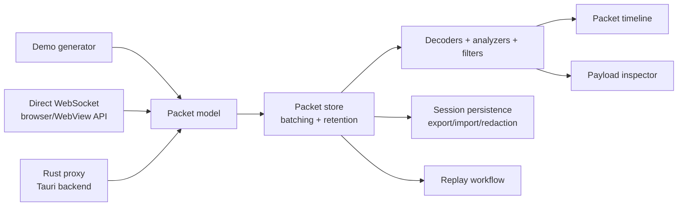
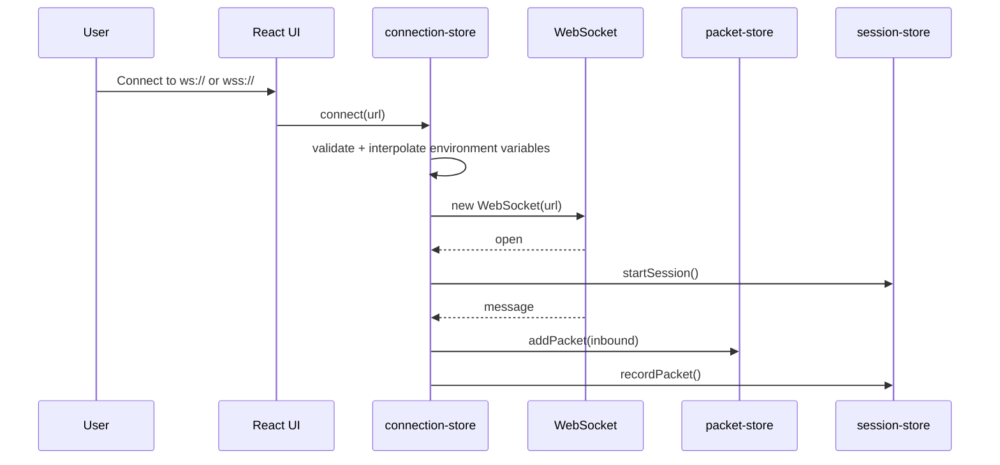
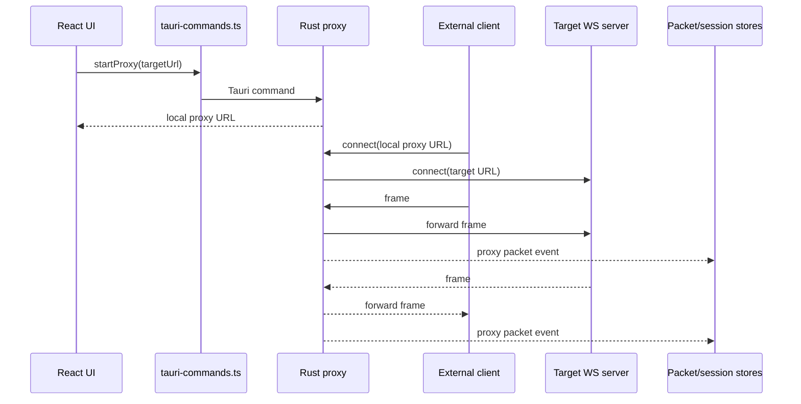
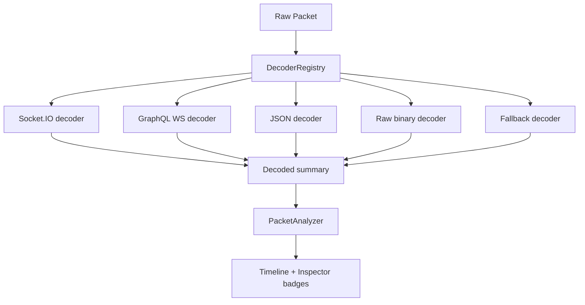
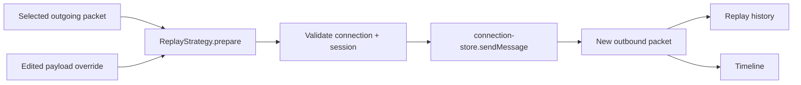
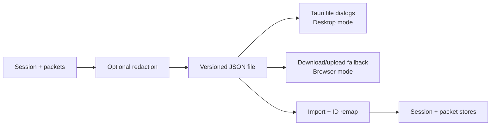

# Architecture

Purpose: explain how SocketLens is structured, how packets flow through the app, and where contributors should add new behavior.

SocketLens is a monorepo-style desktop/web application with a React frontend, Zustand state, Tauri desktop shell, Rust backend for native proxy mode, and local examples.

## Architecture Goals

- Keep capture paths runnable and typed.
- Keep Demo, Direct, and Proxy responsibilities separate.
- Keep payloads immutable after capture.
- Keep protocol understanding in decoders, not React components.
- Keep AI optional and privacy-explicit.
- Keep contributor extension points small and stable.

## High-level System



## Repository Map

```text
apps/desktop
  src
    components       React UI and workspace panels
    components/ui    Shared shadcn-style primitives
    config           Runtime defaults and metadata
    demo             Demo and investor-demo packet generators
    dev              Explicit development helpers
    extensions       Contributor-facing extension contracts and built-in adapters
    i18n             Russian and English UI translations
    lib              Runtime helpers, AI, Tauri wrappers, storage
    models           Typed domain models and file schemas
    store            Zustand stores
  src-tauri
    src              Rust commands, proxy, session registry, app state
apps/landing         Vite landing package
examples/echo-server Node.js WebSocket echo server
examples/socketio-demo
                     Socket.IO demo server
examples/chat-demo   Browser chat example
docs                 User, contributor, release, privacy, and QA docs
launchers            One-click launch scripts
scripts              Repository hygiene and release helper scripts
```

## Core Concepts

| Concept | Meaning |
|---|---|
| Connection | A known endpoint or transport context with URL, name, status, and error metadata. |
| Session | One connection/proxy/demo lifecycle with timestamps, packet counters, byte totals, and close metadata. |
| Packet | One captured inbound or outbound frame with payload, size, direction, payload kind, IDs, and annotations. |
| AppLog | A timestamped lifecycle/debug message shown in the bottom logs panel. |
| AppSettings | Local persisted preferences for language, theme, retention, privacy, onboarding, AI, and timeline behavior. |

Models live in `apps/desktop/src/models`. Components should import typed domain models from `@/models` instead of inventing local packet/session shapes.

## Responsibility Boundaries

| Layer | Location | Owns | Should not own |
|---|---|---|---|
| UI components | `apps/desktop/src/components` | Rendering, user interaction, layout | WebSocket lifecycle, schemas, native commands |
| Domain logic | `apps/desktop/src/models` | Typed models, validation, pure helpers | Browser/Tauri APIs, React rendering |
| Stores | `apps/desktop/src/store` | Runtime state, lifecycle coordination, persistence calls | Presentation-only formatting |
| Services/helpers | `apps/desktop/src/lib` | Tauri bridge, storage, AI runtime, formatting, safe parsing, errors | React UI |
| Extensions | `apps/desktop/src/extensions` | Decoders, analyzers, filters, exporters, AI contracts, replay strategies | Store mutation, UI rendering |
| Rust backend | `apps/desktop/src-tauri/src` | Tauri commands, proxy runtime, native state, user-safe errors | React/Zustand state |

## Frontend Stores

| Store | Responsibility |
|---|---|
| `useConnectionStore` | Direct WebSocket lifecycle, saved connections, active connection/session IDs, send/replay integration. |
| `usePacketStore` | Packet collection, batching, retention enforcement, clearing packets, annotations. |
| `useSessionStore` | Session records, status, packet/byte counters, import/remove/rename. |
| `useUiStore` | Selected packet/session, filters, logs, toasts, composer draft, demo state, replay state. |
| `useSettingsStore` | Persisted settings, onboarding, privacy, AI, timeline preferences. |
| `useEnvironmentStore` | Local/Staging/Production environments, variables, profiles, import/export. |

Runtime objects such as `WebSocket` stay inside runtime stores and are not serialized.

## Direct Mode Flow



Direct Mode does not depend on the Rust backend.

## Proxy Mode Flow



Proxy Mode requires Tauri desktop mode. Browser mode returns a native-backend unavailable state.

## Decoder Pipeline



Decoders are ordered by priority. If a decoder throws or no decoder matches, SocketLens falls back safely.

## Replay Flow



Replay requires an active WebSocket connection. It does not silently reconnect or send without user action.

## Session Persistence Flow



Redaction applies to exported copies. The active in-memory session is not automatically modified.

## Tauri Bridge

Frontend components do not call Tauri `invoke` directly.

They use:

- `apps/desktop/src/lib/tauri-commands.ts`
- `apps/desktop/src/lib/proxy-events.ts`
- `apps/desktop/src/lib/tauri-runtime.ts`

These wrappers:

- return typed results;
- handle browser-only fallback;
- avoid duplicate listeners;
- keep native errors user-facing.

## Rust Backend

| Module | Responsibility |
|---|---|
| `lib.rs` | Builds the Tauri app, registers plugins, manages shared state, wires commands. |
| `commands.rs` | Typed Tauri commands for health, backend status, and proxy control. |
| `app_state.rs` | Shared native state for proxy/session registries. |
| `errors.rs` | User-safe command errors with stable error codes. |
| `proxy.rs` | Async WebSocket proxy listener, target connection, forwarding, event emission. |
| `session.rs` | Native proxy session registry snapshots. |

## Extension Points

Contributor-facing contracts live in `apps/desktop/src/extensions`.

| Extension point | Purpose |
|---|---|
| `PacketDecoder` | Decode payloads into event names, previews, tags, metadata, and typed data. |
| `PacketAnalyzer` | Classify decoded packets as auth/chat/error/notification/heartbeat/ok. |
| `FilterEngine` | Apply search/filter state to packet collections. |
| `ExportAdapter` | Create and serialize export file formats. |
| `AIProvider` | Register optional AI providers behind a stable interface. |
| `ReplayStrategy` | Prepare replay payloads and replay history entries. |

These are source-level contracts, not a remote plugin marketplace.

## Stability Patterns

- Render failures are caught by `ErrorBoundary`.
- User-facing problems appear as inline errors, toasts, and logs.
- Direct socket handlers are detached before cleanup.
- Proxy event listeners are registered through one helper.
- Native commands return typed error results.
- AI is optional and disabled by default.
- Payloads remain raw; views derive summaries.

## Related

- [Project Structure](project-structure.md)
- [Extension Points](extension-points.md)
- [Contributor Guide](contributor-guide.md)
- [Function Inventory](function-inventory.md)
- [Architecture Rules](architecture-rules.md)

## Next Steps

- Add a decoder: [Adding a Decoder](adding-a-decoder.md)
- Add a filter: [Adding a Filter](adding-a-filter.md)
- Validate behavior: [Manual QA](manual-qa.md)

